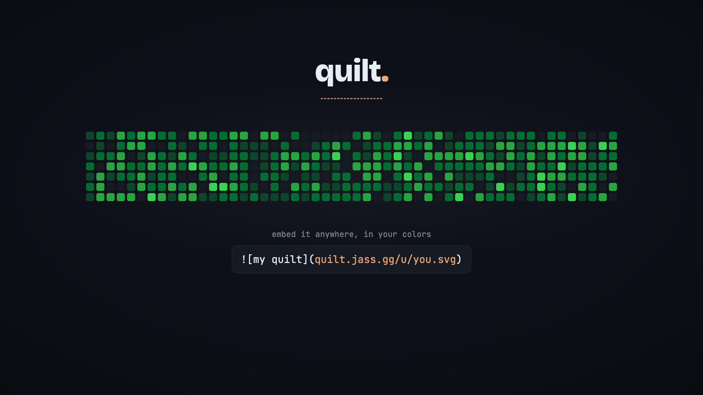

<div align="center">


# quilt

**your contributions, all of them, in one green grid.**

Merge the GitHub contribution graphs of every account you have into one consolidated
quilt of green — so your real activity finally looks as busy as it is.




_one dev. every account. one quilt._

</div>

## How it works

Type your GitHub usernames → quilt fetches each account's contribution calendar,
**sums every day's count across accounts**, recomputes the green levels from the merged
distribution, and paints one GitHub-style grid. The result lives in the URL
(`quilt.jass.gg/?u=jassucyd,jassuwu`), so it's a shareable link.

No login. Nothing stored. All fetch + merge happens in your browser.

## Embed it anywhere

Drop your merged graph into a README or any site with one URL — no build step, no JS:

```md

```

Add `?theme=light` for light READMEs/sites and `?y=2024` for a specific year. The SVG is
rendered server-side and CDN-cached, so it stays fast and current — works anywhere ``
does, GitHub/GitLab READMEs included.

## The data

One source: the [github-contributions-api](https://github.com/grubersjoe/github-contributions-api),
which scrapes the public profile graph — so it includes the **privatized-but-visible**
green your profile already shows (when the account has that setting on). See
[SOURCES.md](SOURCES.md) for why the GitHub GraphQL API doesn't work here.

## Stack

- **Astro 6** + **Tailwind v4** (CSS-first), strict TypeScript, **bun** on **Vercel** — static page + one dynamic, CDN-cached SVG embed route (`@astrojs/vercel`).
- Pure, unit-tested merge core in `src/lib`; the grid, the OG card, and the demo share one green ramp.
- Favicon/PWA icons + the OG share card are generated from one SVG mark via `@resvg/resvg-js`.
- The hero/social demos are a sibling **Remotion** project in [`remotion/`](remotion/).

## Commands

```sh
bun install
bun run dev        # local dev server
bun run test       # unit tests (merge + levels)
bun run typecheck  # astro check
bun run build      # static build → dist/
bun run icons      # regenerate favicon + PWA icon set
bun run og         # regenerate the default OG share card

cd remotion && bun install
bun run dev          # Remotion studio
bun run poster       # still → out/quilt-poster.png
bun run render:hero  # hero demo → out/quilt-hero.mp4
```

## Attribution

Contribution data via [grubersjoe/github-contributions-api](https://github.com/grubersjoe/github-contributions-api).
Fonts: Bricolage Grotesque, Inter, JetBrains Mono (via [Fontsource](https://fontsource.org)).

## License

[MIT](LICENSE)
