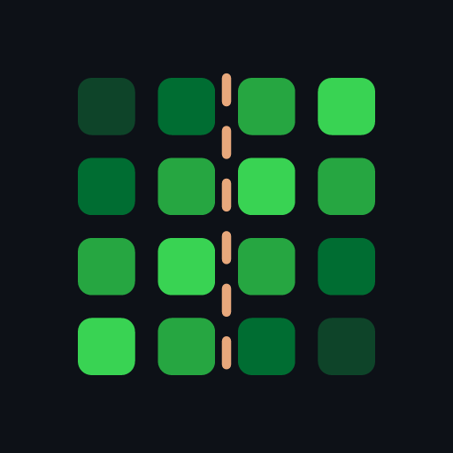

<div align="center">



# quilt

**your contributions, all of them, in one quilt of green.**

merge the GitHub contribution graphs of every account you have into one consolidated
quilt of green — so your real activity finally looks as busy as it is.

**try it → [quilt.jass.gg](https://quilt.jass.gg)** · no login, nothing stored

[](https://quilt.jass.gg)


<a href="https://quilt.jass.gg">
  <picture>
    <source media="(prefers-reduced-motion: reduce)" srcset="./docs/assets/readme/quilt-poster.png" />
    
  </picture>
</a>

_every account, one quilt._

</div>

## how it works

type your GitHub usernames → quilt fetches each account's contribution calendar,
**sums every day's count across accounts**, recomputes the green levels from the merged
distribution, and paints them into one quilt. the result lives in the URL
([quilt.jass.gg/?u=jassuwu,torvalds](https://quilt.jass.gg/?u=jassuwu,torvalds)), so it's
a shareable link.

no login. nothing stored. all fetch + merge happens in your browser.

## embed it anywhere

drop your merged quilt into a README or any site with one URL. no build step, no JS:

```md
[](https://quilt.jass.gg/?u=jassuwu,torvalds)
```

which renders this — live, straight from the CDN, re-stitched as the accounts contribute:

[](https://quilt.jass.gg/?u=jassuwu,torvalds)

style it with query params — `?theme=dracula` (or `nord`, `tokyonight`, `gruvbox`,
`catppuccin`, `solarized`, `mono`, `stitch`), `?theme=light` for light READMEs,
`?color=ff6ac1` and `?bg=160e23` for a custom ramp, `?y=2024` for a specific year —
or tweak it live on the site, including a `<picture>` snippet that follows GitHub's
light/dark mode. the SVG is rendered server-side and CDN-cached. it works anywhere
`` does, GitHub and GitLab READMEs included.

## the data

one source: the [github-contributions-api](https://github.com/grubersjoe/github-contributions-api),
which scrapes the public profile graph — so it includes the **privatized-but-visible**
green your profile already shows (when the account has that setting on). see
[SOURCES.md](SOURCES.md) for why the GitHub GraphQL API doesn't work here.

## stack

- **Astro 6** + **Tailwind v4** (CSS-first), strict TypeScript, **bun** on **Vercel** — static page + one dynamic, CDN-cached SVG embed route (`@astrojs/vercel`).
- pure, unit-tested merge core in `src/lib`; the page, the OG card, and the demo share one green ramp.
- favicon/PWA icons + the OG share card are generated from one SVG mark via `@resvg/resvg-js`.
- the hero/social demos are a sibling **Remotion** project in [`remotion/`](remotion/).

## commands

```sh
bun install
bun run dev        # local dev server
bun run test       # unit tests (merge + levels)
bun run typecheck  # astro check
bun run build      # static build → dist/
bun run icons      # regenerate favicon + PWA icon set
bun run og         # regenerate the default OG share card

cd remotion && bun install
bun run dev          # Remotion studio
bun run poster       # still → out/quilt-poster.png
bun run render:hero  # hero demo → out/quilt-hero.mp4
```

## attribution

contribution data via [grubersjoe/github-contributions-api](https://github.com/grubersjoe/github-contributions-api).
fonts: Bricolage Grotesque, Inter, JetBrains Mono (via [Fontsource](https://fontsource.org)).

## license

[MIT](LICENSE)
